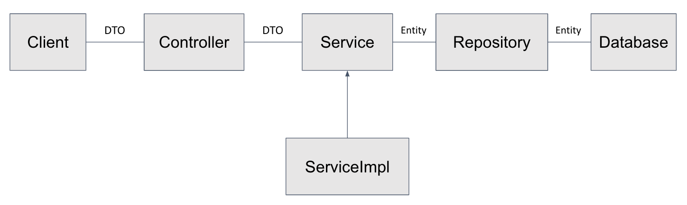

# SpringBoot-jpa
- 기술 스택
    - SpringBoot 3.1.0
    - Java 17
    - Spring Data jpa
    - Gradle
    - MySQL 8.0.33
- 프로젝트 구조
    - `com.springboot.jpa`  
      ㄴ [폴더] `config`  
      ㄴ [폴더] `controller`  
      ㄴ [폴더] `dto`  
      ㄴ [폴더] `entity`  
      ㄴ [폴더] `repository`  
      ㄴ [폴더] `service`
- 애플리케이션 구조
  
- Swagger url
    - http://localhost:8080/swagger-ui/index.html

- todo: dao추가
